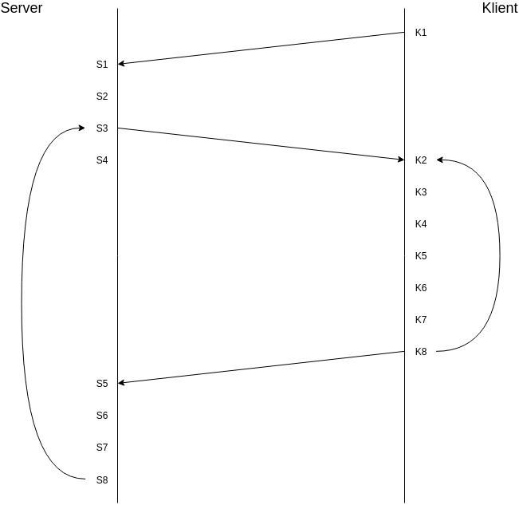

## Protokoll för undercooked:

### Beskrivning av händelseförlopp:

Punkterna nedan beskriver kommunikationen mellan servern och klienten, såväl som vad som behöver hända inuti servern och klienten. kommunikationen visualiseras i följande diagram med index för de olika punkterna:

#### Server:

1. **(S1)** Sätt en timeout på 60 sekunder. Lyssna efter anslutningar via socket på port 1337, vänta på två anslutningar.
2. **(S2)** Förbered spelet genom att generera en spelplan i form av en sträng. Spelarna börjar spelet med tomma händer, och spelet börjar med att det är klient 1:s tur. Allt detta är en del av spelplanssträngen.
3. **(S3)** Skicka spelplanen, att det är klienten vars tur det ärs tur och huruvida spelet är slut till klienten vars tur det är och spelplanen, att det inte är klientens tur och huruvida spelet är slut till klienten vars tur det inte är via sockets. Om det blir timeout, bryt anslutningarna genom att stänga sockets och återställ spelet, återvänd till punkt 1.
4. **(S4)** Kontrollera huruvida spelet är slut. Bryt anslutnigarna, återställ spelet och återvänd till punkt 1 om spelet är slut.
5. **(S5)** Vänta på svar från klienten vars tur det är via socket, ignorera all annan kommunikation. Om det blir timeout, bryt anslutningarna genom att stänga sockets och återställ spelet, återvänd till punkt 1.
6. **(S6)** Se till att datan från klienten vars tur det är är en korrekt formaterad sträng. Annars bryt anslutningarna genom att stänga sockets och återställ spelet, återvänd till punkt 1.
7. **(S7)** Uppdatera spelets tillstånd utifrån klienten vars tur det ärs drag.
8. **(S8)** Ändra vilken klients tur det är. Loopa till punkt 3.

#### Klient:

1. **(K1)** Sätt en timeout på 60 sekunder. Öppna en socket till serverns IP-adress och port 1337.
2. **(K2)** Vänta på att servern skickar data och ta emot datan som skickas. Om det blir timeout, bryt anslutningen genom att stänga socket och avsluta programmet.
3. **(K3)** Se till att servern har skickat en spelplan som följer specifikationen, annars bryt anslutningen genom att stänga socket och avsluta programmet.
4. **(K4)** Printa spelplanen genom att printa 24 tecken från spelplanssträngen i varje kolumn av 80 kolumner.
5. **(K5)** Om servern skickat att spelet är slut, bryt anslutningen till servern, visa den slutgiltiga spelplanen i fem sekunder och avsluta programmet.
6. **(K6)** Om det är klientens tur, lyssna efter input från spelaren. Spelaren ska kunna ge input motsvarande "upp", "ned", "vänster", "höger" och "interagera". Annars återvänd till punkt 2.
7. **(K7)** Formattera spelarens input enligt specifikationen. Exempel: Om spelarens input består av motsvarande "upp", skickas "MOVE<U>".
8. **(K8)** Skicka datan till servern via socket och återvänd till punkt 2.

### Formattering:

#### Datapaket:

Datapaketen är nyradsterminerade strängar som är formatterade som kompakt JSON. Varje datapaket termineras alltså med ett nyradstecken (\n) för att server respektive klienter ska kunna avgöra när ett komplett datapaket är skickat.

##### Server:

Servern skickar en sträng formatterad som kompakt JSON innehållande tre fält:
- yourTurn: en boolean som representerar huruvida det är klientens tur denna runda
- gameOver: en boolean som representerar huruvida spelet är slut
- board: en sträng som representerar spelbrädets tillstånd

Strängen som skickas till klienterna är alltså formatterad enligt följande reguljära uttryck: {"yourTurn":((true)|(false)),"gameOver":((true)|(false)),"board":".{1920}"}\n

Det enda som karaktäriserar spelbrädet är att den har rätt längd. Det är spelets ansvar att generera ett meningsfullt spelbräde och klientens ansvar att visa upp spelbrädet korrekt för spelaren.

##### Klient:

Klienten skickar en sträng formatterad som kompakt JSON innehållande två fält:
- move: en sträng med ett tecken som representerar vilken av riktningarna som spelaren valt att röra sig i, och är null om spelaren valt att interagera
- interact: en boolean som representerar huruvida spelaren har tryck på knappen för att interagera, och är alltid false om spelaren valt att röra på sig

Strängen som skickas till servern är alltså formatterad enligt följande reguljära uttryck: ({"move":"[UDLR]","interact":false})|({"move":null,"interact":true})\n

### Spelplanen:

Spelplanen ska ha 80 kolumner och 24 rader, alltså 1920 tecken totalt. Servern konverterar spelplanen till en sträng kolumn för kolumn, från vänster till höger. Den bör därför också skrivas ut i samma ordning av klienterna.
